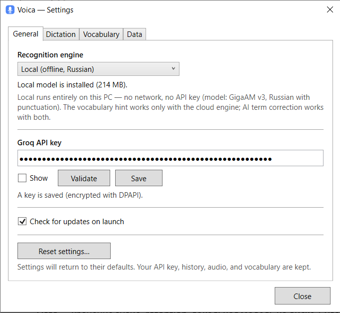
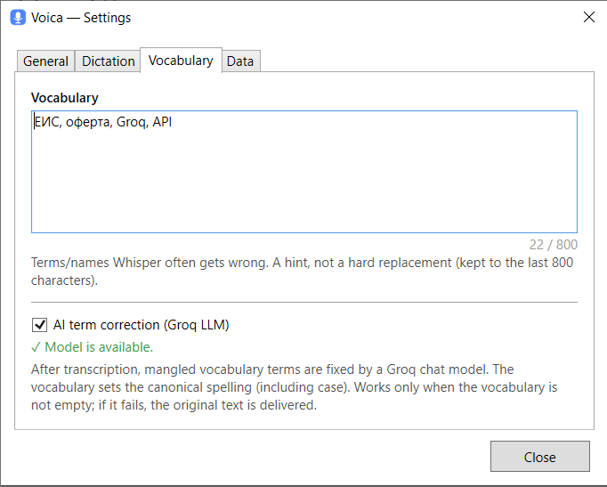
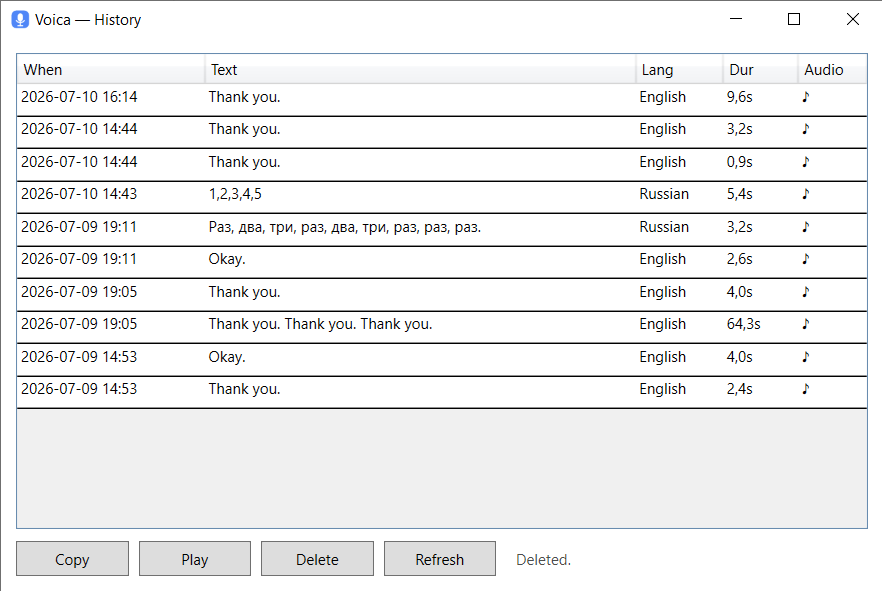
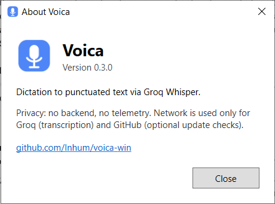

<p align="center"><b>English</b> · <a href="README.ru.md">Русский</a></p>

<p align="center">
  
</p>

<h1 align="center">Voica for Windows</h1>

<p align="center">
  A Windows tray app for voice dictation <b>with punctuation</b>, powered by Groq Whisper.
</p>

<p align="center">
  
  
  
  <a href="https://deepwiki.com/Inhum/voica-win"></a>
</p>

---

Press a hotkey, speak, and Voica inserts clean, punctuated text into whatever field you're
typing in. Bring your own Groq API key.

Voica is a tiny background app that lives in the system tray. It's a native Windows
(C# / .NET 8 / WPF) implementation of [Voica](https://github.com/Inhum/voica) (macOS), and follows
the same cross‑platform [behavior spec](docs/CORE-SPEC.md).

## Features

- **Global hotkey dictation** — Push‑to‑talk (hold) or Toggle (press to start/stop). Default:
  **Toggle + Right Alt**. Pick a preset key (Right/Left Alt, CapsLock, ScrollLock, Pause) or record
  a **custom combination** (e.g. `Ctrl+Shift+Space`).
- **Punctuation via Groq Whisper** (`whisper-large-v3-turbo`) — auto language detection (great for
  mixed Russian/English).
- **Local offline engine** (optional) — recognition fully on your PC via **GigaAM v3** (Russian,
  with punctuation), no network and no API key. If the cloud is selected but the network is down,
  Voica automatically falls back to the local engine when the model is installed.
- **Auto‑insert** into the focused field (synthesized Ctrl+V), and the text is **always** copied to
  the clipboard as a fallback. Or show an editable **result window**.
- **History** (SQLite) — browse, re‑copy, play the audio, delete.
- **Audio retention** — keep recordings for N days (default 30; 0 = keep forever), or don't store
  audio at all.
- **Vocabulary** — a hint list of terms/names Whisper often mangles.
- **Update checks** against this repo's GitHub releases (opt‑in, once a day). Voica never downloads
  or installs anything itself — it just opens the release page.
- **Privacy** — no backend, no telemetry. Network is used only for Groq (cloud transcription /
  AI correction) and GitHub (optional update checks, one‑time model download). With the local
  engine, audio never leaves your PC. Your API key is stored **encrypted with Windows DPAPI**.
- **English & Russian** UI, by system language.

## Screenshots

**Settings** — General (engine + key) and Vocabulary (terms + AI correction):





**History** — browse, re‑copy, play, delete:



**About**, and the tray icon (idle):




## Requirements

- Windows 10 version 1809 (build 17763) or later, x64.
- A **Groq API key** for cloud recognition — create one at <https://console.groq.com> (free tier's
  `whisper-large-v3-turbo`). Not needed if you use the [local offline engine](#local-offline-engine).

## Install

Download from the [latest release](https://github.com/Inhum/voica-win/releases/latest) and run it —
no installer needed:

- **`Voica.exe`** (~80 MB) — fully self‑contained, nothing else to install.
- **`Voica-fx.exe`** (~37 MB) — smaller, but needs the
  [.NET 8 Desktop Runtime](https://dotnet.microsoft.com/download/dotnet/8.0) installed once.

Voica runs in the system tray (no main window). See below about the SmartScreen warning.

## Why does Windows warn about this app?

Voica isn't code‑signed yet, so on first run SmartScreen shows *"Windows protected your PC."*
Click **More info → Run anyway**. This is expected for an independent, unsigned app — not a sign
that something is wrong:

- Voica is **open source**, and every release is **built by GitHub Actions from the tagged commit**
  (release author `github-actions[bot]`), not on anyone's personal machine — so the binary is
  reproducible from the source you can read.
- You can **verify your download**: the release page shows a `sha256:` digest next to each asset.
  Compare it with your file (PowerShell):
  ```powershell
  Get-FileHash Voica.exe -Algorithm SHA256
  ```
  The hash must match the one shown on the release.

Code signing (which removes the warning) is planned once the project has enough public visibility to
qualify for the free [SignPath Foundation](https://signpath.org) program.

## First run

On first launch (with no key set) the **Settings** window opens. Paste your Groq API key, click
**Validate**, then **Save** (it's encrypted with DPAPI). You can also set the key via the
`GROQ_API_KEY` environment variable for development.

## Usage

- **Dictate:** press **Right Alt** (default), speak, press **Right Alt** again to stop (Toggle
  mode). In PTT mode, hold to talk and release to send.
- The recognized text is inserted into the focused field and copied to the clipboard.
- Right‑click the tray icon for **Settings**, **History**, **Check for Updates**, and **About**.

The tray icon reflects state: idle (blue), recording (pulsing red), transcribing (amber).

## Settings

| Setting | Notes |
|---|---|
| Dictation mode | PTT (hold) or Toggle |
| Hotkey | Preset single key or a custom combination |
| Output | Insert into field, or show a result window |
| Store audio recordings | On by default |
| Show a notification after inserting | The tray balloon; can be turned off |
| Check for updates on launch | Once a day, opt‑in |
| Delete audio older than | N days; 0 = keep forever |
| Vocabulary | Terms/names hint (last 800 chars used) |
| Groq API key | Validate + Save (DPAPI); **Show** to reveal |
| Delete all data… | Wipes history, audio, key, settings (random‑phrase confirmation) |

## Data locations

Everything lives outside the executable in `%APPDATA%\Voica\`, so it survives updates:

- `history.sqlite` — transcription history
- `audio\*.wav` — stored recordings (16 kHz mono PCM)
- `credentials.dat` — DPAPI‑encrypted Groq key
- `models\` — the local recognition model (if downloaded)
- `settings.json` — settings
- `voica.log` — local diagnostic log

## Local offline engine

Switch **Settings → General → Recognition engine** to **Local** and Voica transcribes entirely
on your PC with Sber's **GigaAM v3** (MIT) — Russian speech with punctuation and text
normalization, **no network and no API key**. The model (~215 MB, int8 ONNX) downloads once from
this repo's [model release](https://github.com/Inhum/voica-win/releases/tag/model-gigaam-v3-e2e-ctc-int8-1)
with SHA‑256 verification, lives in `%APPDATA%\Voica\models\`, and can be deleted in
Settings → Data. Notes:

- The vocabulary hint (§ Whisper `prompt`) works only with the cloud engine; **AI term
  correction works with both** (it needs a key and network).
- If **cloud** is selected but the network is down and the model is installed, Voica falls back
  to the local engine automatically and shows a small notice.
- With the local engine (and AI correction off), audio and text **never leave your PC**.
- ONNX conversion by [istupakov/gigaam-v3-onnx](https://huggingface.co/istupakov/gigaam-v3-onnx) (MIT).

## Bring your own Groq key

Voica uses **your own** Groq API key (BYO-key) — the app never ships or shares anyone's key.
Each user gets a free key at [console.groq.com](https://console.groq.com); usage is subject
to [Groq's Terms of Use](https://groq.com/terms-of-use). Free-tier limits (whisper-large-v3-turbo):
20 req/min, 2000/day, 7200 audio-seconds/hour — far more than dictation needs.

**If you enable AI term correction** (Settings → Vocabulary), Voica also calls the chat model
`qwen/qwen3-32b`. If your Groq organization restricts model access, allow this model at
console.groq.com → Settings → Limits — otherwise the correction silently falls back to the
raw transcription (fail-open by design). Settings shows a model-availability check next to
the toggle.

## Build from source

Requires the [.NET 8 SDK](https://dotnet.microsoft.com/download).

```powershell
# Build
dotnet build Voica.sln -c Debug

# Self-test (no GUI/network) — exit code 0 on success
Start-Process -FilePath "src\Voica\bin\Debug\net8.0-windows10.0.17763.0\Voica.exe" `
  -ArgumentList "--test-all" -Wait -PassThru -NoNewWindow

# Single-file self-contained release
dotnet publish src\Voica\Voica.csproj -c Release -p:PublishSingleFile=true
```

See [CONTRIBUTING.md](CONTRIBUTING.md) for architecture notes and the self‑test conventions.

## License

[MIT](LICENSE) © Ivan Ushakov.
