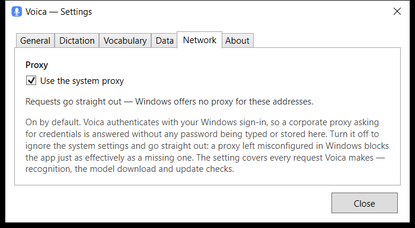

<p align="center"><b>English</b> · <a href="README.ru.md">Русский</a> · <a href="https://github.com/Inhum/voica/blob/main/README.md">macOS version →</a></p>

<p align="center">
  
</p>

<h1 align="center">Voica for Windows</h1>

<p align="center">
  A Windows tray app for voice dictation <b>with punctuation</b>, powered by Groq Whisper.
</p>

<p align="center">
  
  
  
  <a href="https://deepwiki.com/Inhum/voica-win"></a>
  <a href="https://boosty.to/voica"></a>
</p>

---

Press a hotkey, speak, and Voica inserts clean, punctuated text into whatever field you're
typing in. Bring your own Groq API key.

Voica is a tiny background app that lives in the system tray. It's a native Windows
(C# / .NET 8 / WPF) implementation of [Voica](https://github.com/Inhum/voica) (macOS), and follows
the same cross‑platform [behavior spec](docs/CORE-SPEC.md).

## Support the project

Voica is free and stays free — every feature, no subscription. If it saves you time, you can
back the work on [Boosty](https://boosty.to/voica): the road to 1.0 for both the Windows and the
[macOS version](https://github.com/Inhum/voica).

## Features

- **Global hotkey dictation** — Push‑to‑talk (hold) or Toggle (press to start/stop). Default:
  **Toggle + Right Alt**. Pick a preset key (Right/Left Alt, CapsLock, ScrollLock, Pause) or record
  a **custom combination** (e.g. `Ctrl+Shift+Space`). In Toggle mode a **double tap** starts the
  recording, so a stray press can't.
- **Dictation bar** — a floating capsule at the bottom of the screen shows the live level while you
  speak, with **×** to cancel (the audio is discarded) and **✓** to stop and transcribe. It never
  takes focus, so the text still lands in the field you were typing in. Can be turned off, and then
  the tray icon indicates the state instead.
- **Punctuation via Groq Whisper** — pick the model (`whisper-large-v3-turbo` or `whisper-large-v3`)
  and the language (auto‑detect, great for mixed Russian/English, or force Russian/English).
- **Local offline engine** (optional) — recognition fully on your PC via **GigaAM v3** (Russian,
  with punctuation), no network and no API key. If the cloud is selected but the network is down,
  Voica automatically falls back to the local engine when the model is installed. Trade-off: Latin
  words can come out as a mix of alphabets (`Dпсик` instead of `DeepSeek`) — that is exactly what
  the vocabulary fixes, see below. The recognition hint stays cloud-only.
- **Auto‑insert** into the focused field (synthesized Ctrl+V), and the text is **always** copied to
  the clipboard as a fallback. Or show an editable **result window**.
- **History** (SQLite) — browse, **search** (Ctrl+F — it also looks at what the engine heard before
  the corrections, so you find a dictation by what you said), re‑copy, play the audio, delete (one
  or a whole multi‑selection), and **export** the entire history to Markdown, CSV or JSON.
- **Audio retention** — keep recordings for N days (default 30; 0 = keep forever), or don't store
  audio at all.
- **Vocabulary** — list the terms recognition mangles (names, jargon, anglicisms). It works in three
  layers:
  - **Rules, right on your PC.** Garbled spellings are pulled back to the ones you listed — no key,
    no internet, both engines — and it switches itself on whenever the vocabulary isn't empty. This
    is what makes the local engine genuinely self-contained.
  - **A recognition hint** — cloud only: the list goes to Whisper and biases what it hears. Soft
    limit ~800 characters (the model only reads the last ~224 tokens; a live counter in Settings
    shows the budget), so keep the terms that matter at the end of the list.
  - **An AI pass** (Groq LLM), optional — handles what rules cannot: grammatical case and badly
    garbled terms. Needs the key and internet; if the request fails you keep the text the rules
    produced, so it never makes things worse.

  More: [Словарь терминов и ИИ-исправление](docs/terms-ai.ru.md) (in Russian).
- **Text clean-up** — two more rules that run without a key or a network, both on by default and
  both switchable:
  - **Filler sounds go** — the drawn-out "э-э-э", "ммм", "хмм" that mean nothing in speech and
    clutter the text. The rule reads the shape of a word, not a list of spellings, so it catches
    every way recognition happens to spell a mumble. A real word that was merely drawn out is
    straightened rather than dropped ("ну-у-у" → "ну"), and numbers, abbreviations and millimetres
    are left alone. Turn it off if you transcribe speech verbatim — it deletes what was said.
  - **Quotation marks are repaired** — straight quotes become guillemets by position, a missing
    space after a colon comes back, and unpaired quotes are removed. Recognition places quotes
    however it happens to, and the AI pass adds its own; English text is left alone.
- **Works behind a corporate proxy** — Voica uses the proxy Windows is configured with and
  authenticates as the signed‑in user (domain SSO), so no password is typed into the app or stored
  by it. The switch is on the **Network** tab, next to a line saying which route requests actually
  take; turning it off goes straight out. If a proxy refuses, the message names its address.
- **Update checks** against this repo's GitHub releases (opt‑in, once a day). Voica never downloads
  or installs anything itself — it just opens the release page.
- **Privacy** — no backend, no telemetry. Network is used only for Groq (cloud transcription /
  AI correction) and GitHub (optional update checks, one‑time model download). With the local
  engine, audio never leaves your PC. Your API key is stored **encrypted with Windows DPAPI**.
- **English & Russian** UI, by system language.

## Screenshots

**Settings** — six tabs: engine and API key, dictation, vocabulary, data, network, about.





**Dictation bar** — while recording (level wave, cancel, stop):


**History** — the list on the left, the record's text on the right; search covers what was said
before any fixing:


**Tray icon** (idle):


## Requirements

- Windows 10 version 1809 (build 17763) or later, x64.
- A **Groq API key** for cloud recognition — create one at <https://console.groq.com> (free tier's
  `whisper-large-v3-turbo`). Not needed if you use the [local offline engine](#local-offline-engine).

## Install

Take the installer from the [latest release](https://github.com/Inhum/voica-win/releases/latest):

- **`Voica-Setup-<version>.exe`** — the normal way in. It carries the self‑contained build, so
  there is nothing to choose and nothing else to install. It sets Voica up **for your user only**
  (`%LocalAppData%\Programs\Voica`), which means **no UAC prompt**, adds a Start‑menu entry, and
  registers a proper uninstall record. Installing over a running copy offers to close it first.
  Uninstalling removes the program but **keeps your data** — history, settings and the API key stay
  in `%APPDATA%\Voica` (wiping those is the app's own *Delete all data*, which asks you to type a
  confirmation).

The two bare executables stay on the release page for anyone who prefers to run one file with no
installation at all — you just have to know which:

- **`Voica.exe`** (~80 MB) — fully self‑contained, nothing else to install.
- **`Voica-fx.exe`** (~37 MB) — smaller, but needs the
  [.NET 8 Desktop Runtime](https://dotnet.microsoft.com/download/dotnet/8.0) installed once.

Either way Voica runs in the system tray (no main window), and either way your data lives in
`%APPDATA%\Voica`, so you can switch between them without losing anything. See below about the
SmartScreen warning — it applies to the installer too.

## Why does Windows warn about this app?

Voica isn't code‑signed yet, so on first run SmartScreen shows *"Windows protected your PC."*
Click **More info → Run anyway**. This is expected for an independent, unsigned app — not a sign
that something is wrong:

- Voica is **open source**, and every release is **built by GitHub Actions from the tagged commit**
  (release author `github-actions[bot]`), not on anyone's personal machine — so the binary is
  reproducible from the source you can read.
- You can **verify your download**: the release page shows a `sha256:` digest next to each asset.
  Compare it with your file (PowerShell):
  ```powershell
  Get-FileHash Voica.exe -Algorithm SHA256
  ```
  The hash must match the one shown on the release.

Code signing (which removes the warning) is planned once the project has enough public visibility to
qualify for the free [SignPath Foundation](https://signpath.org) program.

## First run

On first launch (with no key set) the **Settings** window opens. Paste your Groq API key, click
**Validate**, then **Save** (it's encrypted with DPAPI). You can also set the key via the
`GROQ_API_KEY` environment variable for development.

## Usage

- **Dictate:** double‑tap **Right Alt** (default), speak, press **Right Alt** once to stop (Toggle
  mode). In PTT mode, hold to talk and release to send.
- While recording, the bar at the bottom of the screen shows the level: **×** cancels (the
  recording is discarded), **✓** stops and transcribes.
- The recognized text is inserted into the focused field and copied to the clipboard.
- Right‑click the tray icon for **Settings**, **History**, **Check for Updates**, and **About**.

With the dictation bar on (the default), the tray icon stays neutral. Turn it off and the icon
reflects state instead: idle (blue), recording (pulsing red), transcribing (amber).

## Settings

| Setting | Notes |
|---|---|
| Dictation mode | PTT (hold) or Toggle |
| Hotkey | Preset single key or a custom combination |
| Double tap to start | Toggle mode only; on by default (0.35 s window) |
| Show a recording bar | The bottom‑of‑screen capsule; on by default |
| Output | Insert into field, or show a result window |
| Store audio recordings | On by default |
| Show a notification after inserting | The tray balloon; can be turned off |
| Check for updates on launch | Once a day, opt‑in |
| Delete audio older than | N days; 0 = keep forever |
| Vocabulary | Terms fixed by rule on both engines; also a cloud hint (last 800 chars used) |
| Fix terms by rules | On by default; the rules that need no key or network |
| Remove "uh", "um", "hmm" | On by default; off if you transcribe verbatim |
| Fix quotation marks | On by default; guillemets, pairing, space after a colon |
| Fix terms with AI | Optional Groq pass on top of the rules; off by default |
| Use the system proxy | On by default (Network tab); off = ignore Windows and go direct |
| Groq API key | Validate + Save (DPAPI); **Show** to reveal |
| Delete the local model… | Frees 214 MB, asks first; the cloud keeps working, and it can be downloaded again |
| Delete all data… | Wipes history, audio, key, settings (random‑phrase confirmation) |

## Data locations

Everything lives outside the executable in `%APPDATA%\Voica\`, so it survives updates:

- `history.sqlite` — transcription history
- `audio\*.wav` — stored recordings (16 kHz mono PCM)
- `credentials.dat` — DPAPI‑encrypted Groq key
- `models\` — the local recognition model (if downloaded)
- `settings.json` — settings
- `voica.log` — local diagnostic log

## Local offline engine

Switch **Settings → General → Recognition engine** to **Local** and Voica transcribes entirely
on your PC with Sber's **GigaAM v3** (MIT) — Russian speech with punctuation and text
normalization, **no network and no API key**. The model (~215 MB, int8 ONNX) downloads once from
this repo's [model release](https://github.com/Inhum/voica-win/releases/tag/model-gigaam-v3-e2e-ctc-int8-1)
with SHA‑256 verification, lives in `%APPDATA%\Voica\models\`, and can be deleted in
Settings → Data (it asks first). The download can be **cancelled** while it runs, and nothing
half‑downloaded is left behind. Notes:

- The vocabulary hint (§ Whisper `prompt`) works only with the cloud engine; **AI term
  correction works with both** (it needs a key and network).
- If **cloud** is selected but the network is down and the model is installed, Voica falls back
  to the local engine automatically and shows a small notice.
- With the local engine (and AI correction off), audio and text **never leave your PC**.
- ONNX conversion by [istupakov/gigaam-v3-onnx](https://huggingface.co/istupakov/gigaam-v3-onnx) (MIT).

### Installing the model by hand

Some networks will not let 215 MB through, or will not let Voica out at all (see
**Behind a corporate proxy** below). The model can be carried in on a USB stick instead: download
the three files from the
[model release](https://github.com/Inhum/voica-win/releases/tag/model-gigaam-v3-e2e-ctc-int8-1) on
any machine and put them, unrenamed, straight into `%APPDATA%\Voica\models\`:

| File | Size | SHA-256 |
|---|---|---|
| `v3_e2e_ctc.int8.onnx` | 224 893 347 | `2e3fcb7a7b66030336fd10c2fcfb033bd1dc7e1bf238fe5cfd83b1d0cfc9d28e` |
| `v3_e2e_ctc.yaml` | 899 | `e67eca3a311ad7c8813d36dff6b8eeba7ad3459fd811d6faea2a26535754a358` |
| `v3_e2e_ctc_vocab.txt` | 2 007 | `142de7570b3de5b3035ce111a89c228e80e6085273731d944093ddf24fa539cd` |

Voica checks these checksums itself the first time it loads a model it did not download, and
remembers the answer — so a truncated copy is reported as such instead of turning into gibberish
recognition. To check them yourself first:

```powershell
Get-FileHash "$env:APPDATA\Voica\models\v3_e2e_ctc.int8.onnx" -Algorithm SHA256
```

## Behind a corporate proxy

Voica works where the only way out is a proxy. It uses the proxy Windows is configured with and
authenticates as the signed-in user, so a domain proxy is answered over SSO — **no password is
typed into Voica or stored by it**. The switch lives in **Settings → Network**, together with a
line saying which route requests are actually taking. Turn it off to ignore the system settings and
go straight out — a proxy left misconfigured in Windows blocks the app just as effectively as a
missing one.

If the proxy refuses, every message names its address: that is the thing to hand to whoever
administers it. If it will not be opened, the local engine plus the manual model install above
gives you an app that needs no network at all.

## Bring your own Groq key

Voica uses **your own** Groq API key (BYO-key) — the app never ships or shares anyone's key.
Each user gets a free key at [console.groq.com](https://console.groq.com); usage is subject
to [Groq's Terms of Use](https://groq.com/terms-of-use). Free-tier limits (whisper-large-v3-turbo):
20 req/min, 2000/day, 7200 audio-seconds/hour — far more than dictation needs.

**If you enable AI term correction** (Settings → Vocabulary), Voica also calls a Groq **chat
model**. The model isn't hardcoded: Voica reads the live model list for your key and picks the
best available one (by default `llama-3.3-70b-versatile`, falling back through other families) —
so when Groq retires or renames a model, the app heals itself instead of needing an update. You
can also pin a specific model in the picker next to the toggle. If your Groq organization
restricts model access, allow the chosen model at console.groq.com → Settings → Limits;
otherwise the correction silently falls back to the raw transcription (fail-open by design).

## Build from source

Requires the [.NET 8 SDK](https://dotnet.microsoft.com/download).

```powershell
# Build
dotnet build Voica.sln -c Debug

# Self-test (no GUI/network) — exit code 0 on success
Start-Process -FilePath "src\Voica\bin\Debug\net8.0-windows10.0.17763.0\Voica.exe" `
  -ArgumentList "--test-all" -Wait -PassThru -NoNewWindow

# Single-file self-contained release
dotnet publish src\Voica\Voica.csproj -c Release -p:PublishSingleFile=true
```

See [CONTRIBUTING.md](CONTRIBUTING.md) for architecture notes and the self‑test conventions.

## License

[MIT](LICENSE) © Ivan Ushakov.
