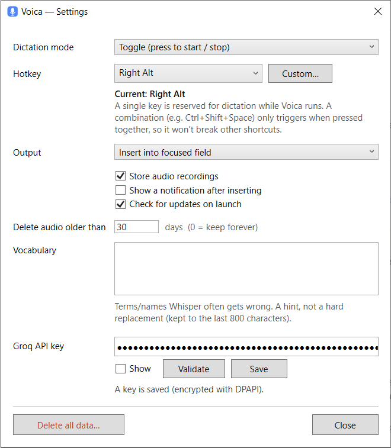

<p align="center">
  
</p>

<h1 align="center">Voica для Windows</h1>

<p align="center">
  Диктовка <b>с пунктуацией</b> для Windows — фоновое приложение в трее на базе Groq Whisper.
</p>

<p align="center">
  
  
  
</p>

<p align="center">
  <a href="README.md">English</a> · Русский
</p>

---

Нажми хоткей, говори — Voica вставит аккуратный текст с пунктуацией прямо в активное поле.
Ключ Groq — свой (BYO‑key).

Voica — маленькое фоновое приложение в системном трее. Это нативная реализация под Windows
(C# / .NET 8 / WPF) приложения [Voica](https://github.com/Inhum/voica) (macOS); поведение задаёт
общая [кросс‑платформенная спека](docs/CORE-SPEC.md).

## Возможности

- **Диктовка по глобальному хоткею** — Push‑to‑talk (удержание) или Toggle (нажал/нажал). По
  умолчанию **Toggle + правый Alt**. Можно выбрать пресет (Right/Left Alt, CapsLock, ScrollLock,
  Pause) или записать **свою комбинацию** (напр. `Ctrl+Shift+Space`).
- **Пунктуация через Groq Whisper** (`whisper-large-v3-turbo`) — автоопределение языка (удобно для
  смеси русского и английского).
- **Авто‑вставка** в активное поле (синтетический Ctrl+V); текст **всегда** также кладётся в буфер
  обмена. Либо — редактируемое **окно результата**.
- **История** (SQLite) — просмотр, повторное копирование, воспроизведение аудио, удаление.
- **Хранение аудио** — N дней (по умолчанию 30; 0 = хранить всегда) или не хранить вовсе.
- **Словарь** — подсказка из терминов/названий, которые Whisper часто коверкает.
- **Проверка обновлений** по релизам этого репозитория (опционально, раз в сутки). Voica ничего не
  качает и не ставит сама — только открывает страницу релиза.
- **Приватность** — нет бэкенда и телеметрии. Сеть только к Groq (расшифровка) и GitHub (проверка
  обновлений). Ключ хранится **зашифрованным через Windows DPAPI**.
- **Интерфейс на английском и русском** — по языку системы.

## Скриншоты

**Настройки** — всё приложение в одном окне:



**История** — просмотр, повторное копирование, воспроизведение, удаление:


**О программе** и иконка в трее (покой):


## Требования

- Windows 10 версии 1809 (сборка 17763) или новее, x64.
- **Ключ Groq API** — получить на <https://console.groq.com>. Используется `whisper-large-v3-turbo`
  (free tier).

## Установка

1. Скачай `Voica.exe` из [последнего релиза](https://github.com/Inhum/voica-win/releases/latest).
2. Запусти. Это один самодостаточный файл — без установщика, .NET не требуется.
   - Сборка **пока без подписи**, поэтому SmartScreen может предупредить («Система Windows защитила
     ваш компьютер»). Нажми **Подробнее → Выполнить в любом случае**. (Подпись через SignPath —
     в планах.)
3. Voica появится в трее (главного окна нет).

## Первый запуск

При первом запуске (если ключ не задан) откроется окно **Настроек**. Вставь ключ Groq, нажми
**Validate**, затем **Save** (шифруется через DPAPI). Для разработки ключ можно задать через
переменную окружения `GROQ_API_KEY`.

## Как пользоваться

- **Диктовка:** нажми **правый Alt** (по умолчанию), говори, нажми **правый Alt** ещё раз для
  остановки (режим Toggle). В режиме PTT — держи, чтобы говорить, отпусти для отправки.
- Распознанный текст вставится в активное поле и попадёт в буфер обмена.
- Правый клик по иконке в трее — **Настройки**, **История**, **Проверить обновления**, **О программе**.

Иконка отражает состояние: покой (синяя), запись (пульсирующая красная), расшифровка (янтарная).

## Данные

Всё хранится вне exe, в `%APPDATA%\Voica\`, чтобы переживать обновления:

- `history.sqlite` — история расшифровок
- `audio\*.wav` — сохранённые записи (16 кГц, моно, PCM)
- `credentials.dat` — ключ Groq, зашифрованный DPAPI
- `settings.json` — настройки
- `voica.log` — локальный лог диагностики

## Сборка из исходников

Нужен [.NET 8 SDK](https://dotnet.microsoft.com/download).

```powershell
# Сборка
dotnet build Voica.sln -c Debug

# Самотест (без GUI и сети) — код возврата 0 при успехе
Start-Process -FilePath "src\Voica\bin\Debug\net8.0-windows10.0.17763.0\Voica.exe" `
  -ArgumentList "--test-all" -Wait -PassThru -NoNewWindow

# Релиз одним файлом (self-contained)
dotnet publish src\Voica\Voica.csproj -c Release -p:PublishSingleFile=true
```

Заметки по архитектуре и самотесту — в [CONTRIBUTING.md](CONTRIBUTING.md).

## Лицензия

[MIT](LICENSE) © Иван Ушаков.
