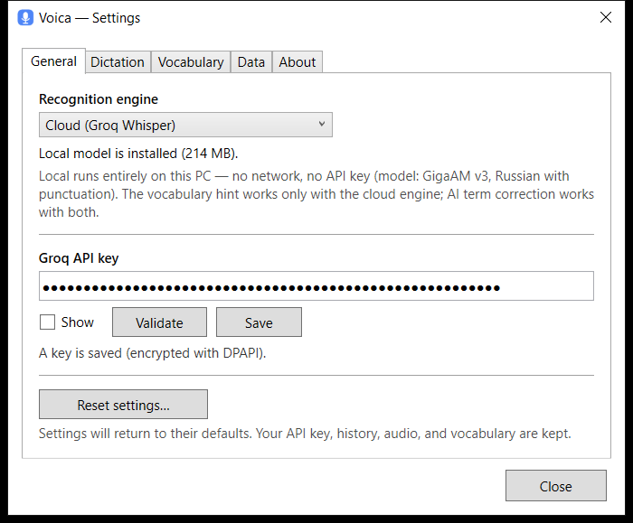
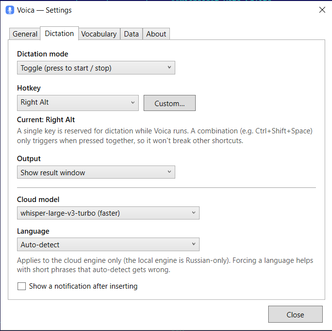
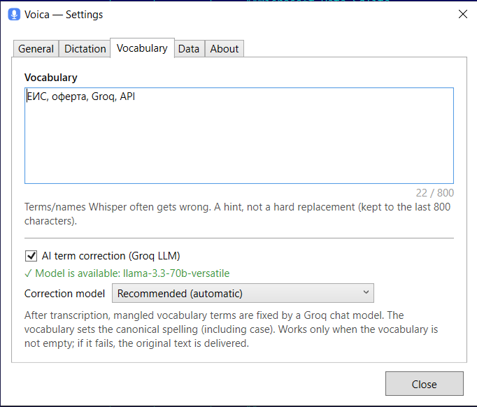
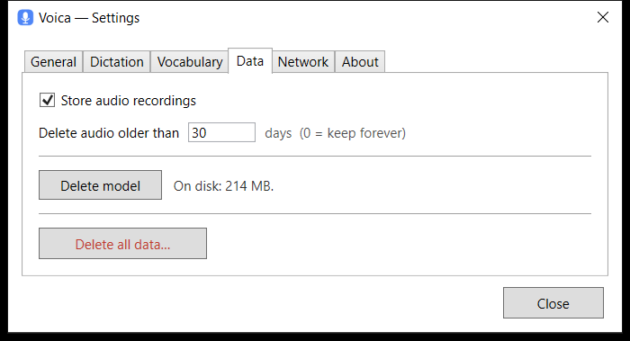
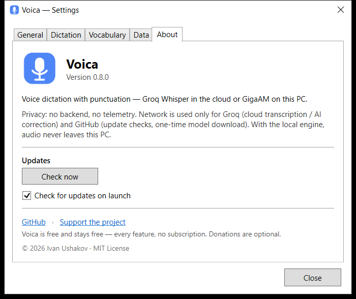
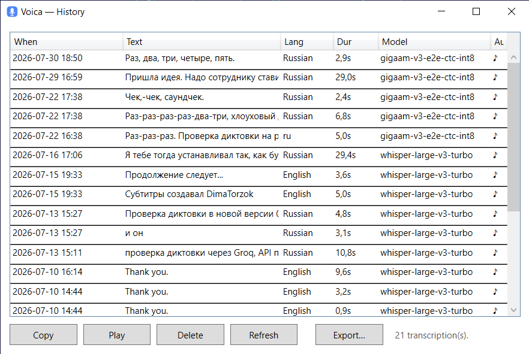

<p align="center"><a href="README.md">English</a> · <b>Русский</b> · <a href="https://github.com/Inhum/voica/blob/main/README.ru.md">Версия для macOS →</a></p>

<p align="center">
  
</p>

<h1 align="center">Voica для Windows</h1>

<p align="center">
  Диктовка <b>с пунктуацией</b> для Windows — фоновое приложение в трее на базе Groq Whisper.
</p>

<p align="center">
  
  
  
  <a href="https://deepwiki.com/Inhum/voica-win"></a>
  <a href="https://boosty.to/voica"></a>
</p>

---

Нажми хоткей, говори — Voica вставит аккуратный текст с пунктуацией прямо в активное поле.
Ключ Groq — свой (BYO‑key).

Voica — маленькое фоновое приложение в системном трее. Это нативная реализация под Windows
(C# / .NET 8 / WPF) приложения [Voica](https://github.com/Inhum/voica) (macOS); поведение задаёт
общая [кросс‑платформенная спека](docs/CORE-SPEC.md).

## Поддержать проект

Voica бесплатна и останется бесплатной — все функции, без подписки. Если она экономит вам
время, поддержать работу можно на [Boosty](https://boosty.to/voica): путь к 1.0 для Windows и
[версии для macOS](https://github.com/Inhum/voica).

## Возможности

- **Диктовка по глобальному хоткею** — Push‑to‑talk (удержание) или Toggle (нажал/нажал). По
  умолчанию **Toggle + правый Alt**. Можно выбрать пресет (Right/Left Alt, CapsLock, ScrollLock,
  Pause) или записать **свою комбинацию** (напр. `Ctrl+Shift+Space`). В режиме Toggle запись
  начинается **двойным тапом**, чтобы случайное нажатие её не запускало.
- **Плашка диктовки** — плавающая капсула внизу экрана показывает уровень, пока ты говоришь, с
  кнопками **×** (отменить — запись выбрасывается) и **✓** (стоп и распознать). Фокус не
  перехватывает, поэтому текст попадёт туда, где ты печатал. Можно выключить — тогда состояние
  показывает иконка в трее.
- **Пунктуация через Groq Whisper** — выбор модели (`whisper-large-v3-turbo` или
  `whisper-large-v3`) и языка (автоопределение — удобно для смеси русского и английского, либо
  жёстко русский/английский).
- **Локальный офлайн-движок** (опционально) — распознавание целиком на твоём ПК через **GigaAM v3**
  (русский, с пунктуацией), без сети и без ключа. Если выбрано облако, а сети нет — Voica сама
  переключится на локальный движок (когда модель установлена).
- **Авто‑вставка** в активное поле (синтетический Ctrl+V); текст **всегда** также кладётся в буфер
  обмена. Либо — редактируемое **окно результата**.
- **История** (SQLite) — просмотр, **поиск** (Ctrl+F; ищет и по тому, что услышало распознавание
  до исправлений, — чтобы найти диктовку по сказанному), повторное копирование, воспроизведение
  аудио, удаление (по одной или сразу выделенной пачкой) и **экспорт** всей истории в Markdown,
  CSV или JSON.
- **Хранение аудио** — N дней (по умолчанию 30; 0 = хранить всегда) или не хранить вовсе.
- **Словарь** — впишите термины, которые распознавание коверкает (названия, жаргон, англицизмы),
  и Voica подтянет искажённые написания к словарным **по правилам**: без ключа, без интернета,
  на обоих движках. Облачному движку список вдобавок уходит подсказкой прямо при распознавании
  (~800 символов, есть счётчик бюджета). Опциональный **ИИ-проход** (Groq LLM) разбирает то, что
  правилам не под силу, — падежи и сильно искажённые термины. Подробнее:
  [Словарь терминов и ИИ-исправление](docs/terms-ai.ru.md).
- **Проверка обновлений** по релизам этого репозитория (опционально, раз в сутки). Voica ничего не
  качает и не ставит сама — только открывает страницу релиза.
- **Приватность** — нет бэкенда и телеметрии. Сеть — только Groq (облачная расшифровка /
  ИИ-исправление) и GitHub (проверка обновлений, разовая докачка модели). С локальным движком
  аудио не покидает твой ПК. Ключ хранится **зашифрованным через Windows DPAPI**.
- **Интерфейс на английском и русском** — по языку системы.

## Скриншоты

**Настройки** — пять вкладок: движок и ключ, диктовка, словарь, данные, о программе.











**Плашка диктовки** — во время записи (уровень, отмена, стоп):


**История** — просмотр, копирование, воспроизведение, удаление, экспорт:



**Иконка в трее** (покой):


## Требования

- Windows 10 версии 1809 (сборка 17763) или новее, x64.
- **Ключ Groq API** для облачного распознавания — получить на <https://console.groq.com> (free
  tier `whisper-large-v3-turbo`). Не нужен, если пользуешься [локальным офлайн-движком](#локальный-офлайн-движок).

## Установка

Бери установщик из [последнего релиза](https://github.com/Inhum/voica-win/releases/latest):

- **`Voica-Setup-<версия>.exe`** — обычный путь. Внутри самодостаточная сборка, поэтому выбирать
  нечего и доставлять нечего. Ставит Voica **только для твоего пользователя**
  (`%LocalAppData%\Programs\Voica`), а значит **без запроса UAC**, добавляет ярлык в «Пуск» и
  нормальную запись для удаления. Установка поверх работающей копии предложит её закрыть.
  Удаление сносит программу, но **данные оставляет**: история, настройки и ключ остаются в
  `%APPDATA%\Voica` (стереть их — это «Удалить все данные» в самом приложении, с подтверждением
  фразой).

Два голых exe остаются на странице релиза для тех, кто предпочитает запускать один файл вообще без
установки, — надо только знать, какой из них:

- **`Voica.exe`** (~80 МБ) — самодостаточный, ничего ставить не нужно.
- **`Voica-fx.exe`** (~37 МБ) — меньше, но нужен разово установленный
  [.NET 8 Desktop Runtime](https://dotnet.microsoft.com/download/dotnet/8.0).

В любом варианте Voica работает в трее (главного окна нет), и в любом данные лежат в
`%APPDATA%\Voica` — переключаться между способами можно ничего не теряя. Про предупреждение
SmartScreen — ниже, оно относится и к установщику.

## Почему Windows ругается на приложение?

Voica пока без подписи, поэтому при первом запуске SmartScreen пишет «Система Windows защитила
ваш компьютер». Нажми **Подробнее → Выполнить в любом случае**. Для независимого неподписанного
приложения это норма, а не признак проблемы:

- Voica — **open source**, и каждый релиз **собирается в GitHub Actions из отмеченного тегом
  коммита** (автор релиза — `github-actions[bot]`), а не на чьём-то ноутбуке, — то есть бинарник
  воспроизводим из кода, который можно прочитать.
- Загрузку можно **проверить**: на странице релиза рядом с каждым файлом показан `sha256:`.
  Сравни с хешем своего файла (PowerShell):
  ```powershell
  Get-FileHash Voica.exe -Algorithm SHA256
  ```
  Хеш должен совпасть с указанным в релизе.

Подпись кода (она убирает предупреждение) появится, когда у проекта будет достаточно публичной
известности для бесплатной программы [SignPath Foundation](https://signpath.org).

## Первый запуск

При первом запуске (если ключ не задан) откроется окно **Настроек**. Вставь ключ Groq, нажми
**Validate**, затем **Save** (шифруется через DPAPI). Для разработки ключ можно задать через
переменную окружения `GROQ_API_KEY`.

## Как пользоваться

- **Диктовка:** дважды нажми **правый Alt** (по умолчанию), говори, нажми **правый Alt** один раз
  для остановки (режим Toggle). В режиме PTT — держи, чтобы говорить, отпусти для отправки.
- Во время записи плашка внизу экрана показывает уровень: **×** — отменить (запись выбрасывается),
  **✓** — стоп и распознать.
- Распознанный текст вставится в активное поле и попадёт в буфер обмена.
- Правый клик по иконке в трее — **Настройки**, **История**, **Проверить обновления**, **О программе**.

Пока плашка включена (по умолчанию), иконка в трее не меняется. Если выключить — состояние
отражает иконка: покой (синяя), запись (пульсирующая красная), расшифровка (янтарная).

## Данные

Всё хранится вне exe, в `%APPDATA%\Voica\`, чтобы переживать обновления:

- `history.sqlite` — история расшифровок
- `audio\*.wav` — сохранённые записи (16 кГц, моно, PCM)
- `credentials.dat` — ключ Groq, зашифрованный DPAPI
- `models\` — локальная модель распознавания (если скачана)
- `settings.json` — настройки
- `voica.log` — локальный лог диагностики

## Локальный офлайн-движок

Переключи **Настройки → General → Recognition engine** на **Local** — и Voica распознаёт речь
целиком на твоём ПК моделью Sber **GigaAM v3** (MIT): русский с пунктуацией и нормализацией,
**без сети и без ключа**. Модель (~215 МБ, int8 ONNX) скачивается один раз из
[model-релиза этого репозитория](https://github.com/Inhum/voica-win/releases/tag/model-gigaam-v3-e2e-ctc-int8-1)
с проверкой SHA-256, живёт в `%APPDATA%\Voica\models\` и удаляется в Настройках → Data. Нюансы:

- Подсказка-словарь (Whisper `prompt`) работает только с облаком; **ИИ-исправление — с обоими
  движками** (ему нужны ключ и сеть).
- Если выбрано **облако**, а сети нет и модель установлена — Voica автоматически распознает
  локально и покажет ненавязчивое уведомление.
- С локальным движком (и выключенным ИИ-исправлением) аудио и текст **никуда не отправляются**.
- Конвертация в ONNX — [istupakov/gigaam-v3-onnx](https://huggingface.co/istupakov/gigaam-v3-onnx) (MIT).

## Свой ключ Groq (BYO-key)

Voica использует ваш **собственный** ключ Groq — приложение ничей ключ не раздаёт.
Бесплатный ключ можно получить на [console.groq.com](https://console.groq.com); использование
Groq API подчиняется [условиям Groq](https://groq.com/terms-of-use). Лимиты free-tier
(whisper-large-v3-turbo): 20 запросов/мин, 2000/день, 7200 аудио-секунд/час — для диктовки
более чем достаточно.

**Если включаете ИИ-исправление терминов** (Настройки → Словарь), Voica дополнительно
обращается к **chat-модели** Groq. Модель не захардкожена: приложение читает живой список
моделей вашего ключа и берёт лучшую доступную (по умолчанию `llama-3.3-70b-versatile`, дальше
по цепочке запасных) — поэтому, когда Groq снимает или переименовывает модель, приложение
чинит себя само, без обновления. Конкретную модель можно закрепить в списке рядом с тумблером.
Если в вашей организации Groq доступ к моделям ограничен — разрешите выбранную модель в
console.groq.com → Settings → Limits, иначе исправление будет молча откатываться к исходному
тексту (fail-open по замыслу).

## Сборка из исходников

Нужен [.NET 8 SDK](https://dotnet.microsoft.com/download).

```powershell
# Сборка
dotnet build Voica.sln -c Debug

# Самотест (без GUI и сети) — код возврата 0 при успехе
Start-Process -FilePath "src\Voica\bin\Debug\net8.0-windows10.0.17763.0\Voica.exe" `
  -ArgumentList "--test-all" -Wait -PassThru -NoNewWindow

# Релиз одним файлом (self-contained)
dotnet publish src\Voica\Voica.csproj -c Release -p:PublishSingleFile=true
```

Заметки по архитектуре и самотесту — в [CONTRIBUTING.md](CONTRIBUTING.md).

## Лицензия

[MIT](LICENSE) © Иван Ушаков.
